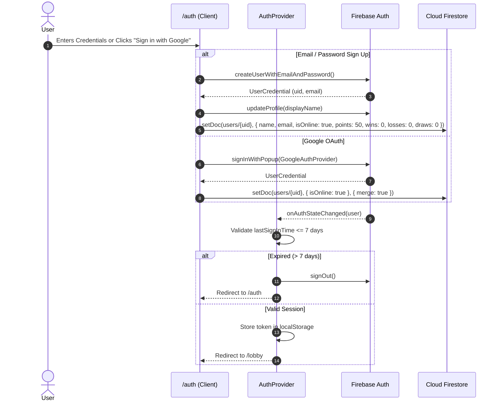
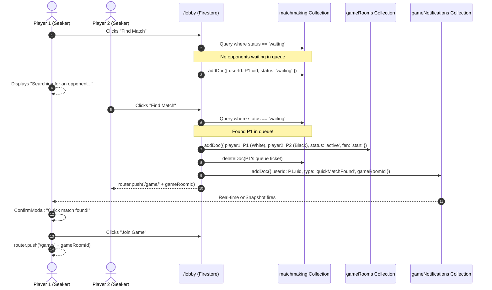
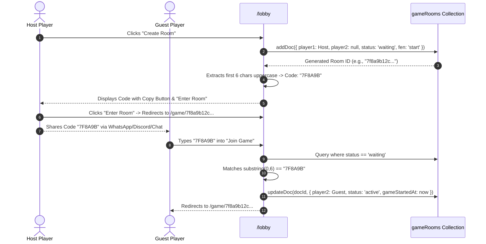
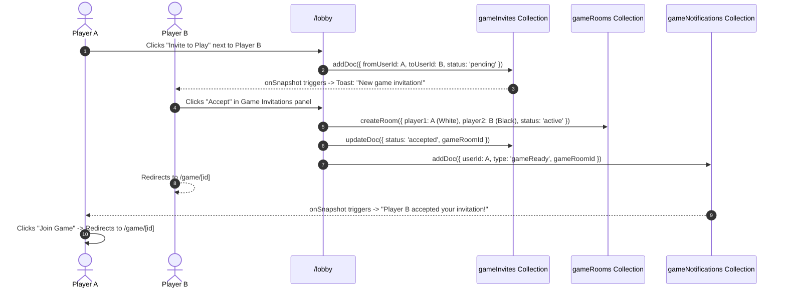
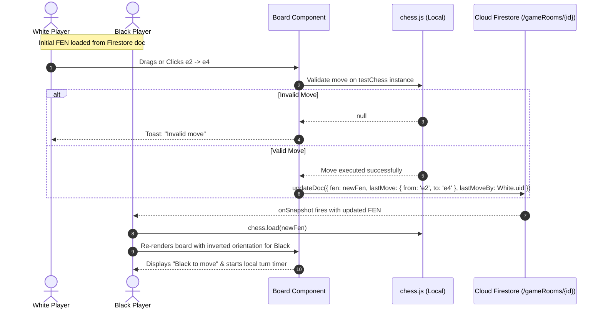
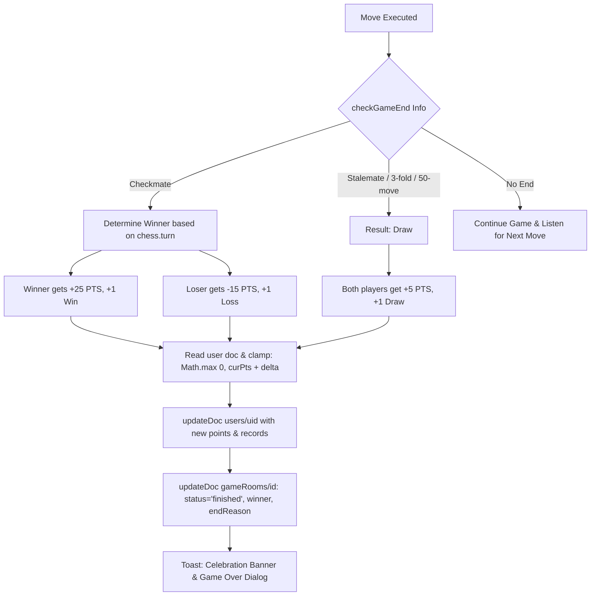
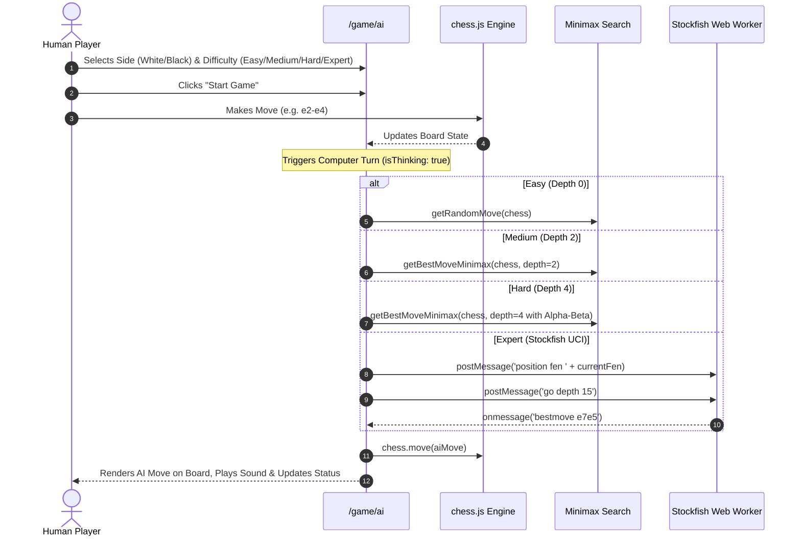

# ⚡ CyberChess (Chesso) — Chess Reimagined

[](https://nextjs.org/)
[](https://react.dev/)
[](https://firebase.google.com/)
[](https://github.com/jhlywa/chess.js)
[](https://stockfishchess.org/)
[](https://web.dev/progressive-web-apps/)

> **CyberChess** is a futuristic, cyberpunk-themed real-time multiplayer chess platform. Built with **Next.js 14 (App Router)**, **Firebase Authentication & Firestore**, **Chess.js**, and **Stockfish AI**, it brings grandmaster-grade chess into a gamified, neon-infused arena with instant matchmaking, live room codes, social networking, global chat, ELO rating tiers, and progressive web app capabilities.

---

## 📑 Table of Contents

1. [Project Overview & Key Features](#-project-overview--key-features)
2. [Tech Stack & Architecture](#-tech-stack--architecture)
3. [Project Directory Structure](#-project-directory-structure)
4. [Core Workflows & Sequence Diagrams](#-core-workflows--sequence-diagrams)
   - [1. Authentication & Session Lifecycle](#1-authentication--session-lifecycle)
   - [2. Quick Match Matchmaking Workflow](#2-quick-match-matchmaking-workflow)
   - [3. Room Code (Private Game) Workflow](#3-room-code-private-game-workflow)
   - [4. Social System & Direct Game Invitation](#4-social-system--direct-game-invitation)
   - [5. Real-Time Gameplay & Move Synchronization](#5-real-time-gameplay--move-synchronization)
   - [6. Game Over & Points/Rating Calculation](#6-game-over--pointsrating-calculation)
   - [7. Play vs Computer (Stockfish & Minimax AI)](#7-play-vs-computer-stockfish--minimax-ai)
5. [Database Schema (Cloud Firestore)](#-database-schema-cloud-firestore)
6. [Security Rules (Firestore)](#-security-rules-firestore)
7. [Rating & Tier Ranking System](#-rating--tier-ranking-system)
8. [Environment Configuration](#-environment-configuration)
9. [Getting Started & Local Setup](#-getting-started--local-setup)
10. [PWA & Offline Configuration](#-pwa--offline-configuration)
11. [Troubleshooting & FAQ](#-troubleshooting--faq)

---

## 🌟 Project Overview & Key Features

### 🎮 Game Modes
- **Real-Time 1v1 Multiplayer**: Play peer-to-peer over Cloud Firestore listeners with sub-second state synchronization and drag-and-drop / click-to-move piece controls.
- **Quick Match Queue**: Instant matchmaking that pairs waiting players automatically without sharing codes.
- **Custom Private Rooms**: Create 6-character room codes (`#ABC123`) to share with friends for instant private match creation.
- **Play vs Computer (AI Engine)**:
  - 🟢 **Easy**: Random legal moves for beginners.
  - 🟡 **Medium**: Depth-2 Minimax with piece-square evaluation matrix.
  - 🔴 **Hard**: Depth-4 Minimax with alpha-beta pruning and positional tables.
  - 🟣 **Expert**: Full Stockfish Web Worker engine integration (Depth 15 UCI).

### 👥 Social & Lobby Ecosystem
- **Player ID Generator**: Deterministic 6-character alphanumeric gamer tag (e.g. `#K9X2P1`) generated from user UID.
- **Global Public Chat**: Live chat stream in the lobby with message deletion and auto-scroll.
- **Friend System**: Send friend requests, accept/decline incoming requests, view online presence status.
- **Direct Invitations**: Send game challenges directly from player list or friend list with instant push toast notifications.
- **Online Presence Heartbeat**: Automatically tracks online/offline states using `beforeunload` event listeners and Firestore triggers.

### 🏆 Gamification & Ranking
- **ELO-Style Points System**: Gain `+25 PTS` for victories, `-15 PTS` for defeats, and `+5 PTS` for stalemates/draws (protected from dropping below 0).
- **Competitive Tiers**:
  - ♟ **Pawn**: 0 – 299 PTS
  - ♝ **Knight**: 300 – 499 PTS
  - ♞ **Expert**: 500 – 699 PTS
  - ♜ **Master**: 700 – 899 PTS
  - ♛ **Grand Master**: 900+ PTS
- **Global Top-50 Leaderboard**: Live ranking with medal badges (🥇, 🥈, 🥉), dynamic tier emblems, and instant personal rank resolution.
- **Player Profile**: Match history log (last 10 matches with win/loss/draw indicators), win rate percentage, and display name customization.

### 🎨 Design System & UI/UX
- **Cyberpunk Theme**: Glowing neon gold accents (`#f5c542`), deep space obsidian backgrounds (`#0a0a0f`), cybernetic borders, and glassmorphism cards.
- **Dual Theme Support**: Dynamic Dark / Light theme switcher with local storage persistence.
- **Next.js Typography**: Google Fonts integration using `Orbitron` (display headings), `Rajdhani` (futuristic UI elements), and `Inter` (body copy).
- **Micro-Interactions**: Custom SVG animated Knight emblem, custom modal prompts, and dynamic context toast notifications (`success`, `warning`, `error`, `info`).

---

## 🛠 Tech Stack & Architecture

```
┌─────────────────────────────────────────────────────────────┐
│                    Client (Next.js 14 App Router)           │
│                                                             │
│   ┌──────────────┐   ┌───────────────┐   ┌──────────────┐   │
│   │  Auth Page   │   │  Lobby Arena  │   │  Game Board  │   │
│   │  (/auth)     │   │  (/lobby)     │   │  (/game/[id])│   │
│   └──────┬───────┘   └───────┬───────┘   └──────┬───────┘   │
│          │                   │                  │           │
│   ┌──────┴───────┐   ┌───────┴───────┐   ┌──────┴───────┐   │
│   │ Leaderboard  │   │  Profile Page │   │  AI Engine   │   │
│   │ (/leaderbd)  │   │  (/profile)   │   │  (/game/ai)  │   │
│   └──────────────┘   └───────────────┘   └──────────────┘   │
└──────────────────────────────┬──────────────────────────────┘
                               │
            ┌──────────────────┴──────────────────┐
            ▼                                     ▼
 ┌─────────────────────┐              ┌─────────────────────┐
 │ Firebase Auth       │              │ Cloud Firestore     │
 │ - Email / Password  │              │ - users             │
 │ - Google OAuth      │              │ - gameRooms         │
 │ - 7-Day Session TTL │              │ - matchmaking       │
 └─────────────────────┘              │ - gameInvites       │
                                      │ - friendships       │
                                      │ - globalChat        │
                                      └─────────────────────┘
```

| Layer | Technology | Purpose |
| :--- | :--- | :--- |
| **Framework** | [Next.js 14.2](https://nextjs.org/) | React App Router, SSR/CSR, route optimization |
| **UI Library** | [React 18](https://react.dev/) | Component architecture, state hooks, context providers |
| **Styling** | Vanilla CSS Modules | Zero runtime CSS overhead, scoped styles, neon cyber design |
| **Chess Validation** | [Chess.js 1.4](https://github.com/jhlywa/chess.js) | Rule enforcement, move validation, FEN generation, checkmate/stalemate |
| **AI Engine** | [Stockfish](https://stockfishchess.org/) + Minimax | Web Worker Stockfish engine (UCI) + fallback minimax with alpha-beta |
| **Backend & DB** | [Firebase 12 (Client SDK)](https://firebase.google.com/) | Real-time document streams (`onSnapshot`), Authentication, Firestore NoSQL |
| **Fonts** | Google Fonts (`next/font`) | Orbitron, Rajdhani, Inter |
| **PWA** | Web Manifest + Service Worker | App installability, asset caching, mobile-first responsiveness |

---

## 📁 Project Directory Structure

```text
Chesso/
├── app/
│   ├── auth/
│   │   ├── auth.module.css          # Cyberpunk auth container & tab styles
│   │   └── page.jsx                 # Login, signup, and Google OAuth handlers
│   ├── game/
│   │   ├── [roomId]/
│   │   │   └── page.jsx             # Live 1v1 multiplayer game room
│   │   ├── ai/
│   │   │   ├── ai.module.css        # AI setup modal & game UI styles
│   │   │   └── page.jsx             # Stockfish & Minimax offline engine game
│   │   └── game.module.css          # Shared chessboard, timer & sidebar styles
│   ├── leaderboard/
│   │   ├── leaderboard.module.css   # Top-50 leaderboard rankings styles
│   │   └── page.jsx                 # Global ranking query & personal rank spotlight
│   ├── lobby/
│   │   ├── lobby.module.css         # Arena lobby layout, chat, tabs & cards
│   │   └── page.jsx                 # Matchmaking, room creation, chat, friends
│   ├── profile/
│   │   ├── profile.module.css       # Profile card, stats grid & match history
│   │   └── page.jsx                 # Display name editor & game history viewer
│   ├── globals.css                  # Global variables, themes, animations & resets
│   ├── layout.js                    # Root layout with font definitions & providers
│   └── page.js                      # Root router: redirects to /lobby or /auth
├── components/
│   ├── AuthProvider.jsx             # Firebase auth state listener & 7-day session guard
│   ├── ConfirmModal.jsx             # Cyberpunk modal for actions (delete, logout, etc.)
│   ├── ConfirmModal.module.css      # Modal overlay & animation styles
│   ├── Footer.jsx                   # Global footer with branding & copyright
│   ├── Footer.module.css            # Footer layout styles
│   ├── Logo.jsx                     # Geometric Cyber-Knight emblem SVG component
│   ├── Logo.module.css              # Neon gradient & pulsing animations
│   ├── ServiceWorkerRegister.jsx    # Client-side PWA service worker registration
│   ├── ThemeProvider.jsx            # Dark / light theme context & local storage sync
│   ├── Toast.jsx                    # Floating toast notifications (success/error/info)
│   └── Toast.module.css             # Glassmorphic toast styles & slide animations
├── lib/
│   └── firebase.js                  # Firebase App, Auth & Firestore singleton init
├── public/
│   ├── favicons/                    # Multi-resolution favicon files
│   ├── icons/
│   │   ├── logo.svg                 # Vector brand emblem
│   │   ├── logo.png                 # Rasterized application icon (192px/512px)
│   │   └── logo.jpg                 # Background banner
│   ├── manifest.json                # PWA Progressive Web App manifest
│   └── sw.js                        # Cache service worker for offline shell
├── .env.local                       # Firebase API keys & project credentials
├── FIREBASE_SETUP.md                # Firebase setup checklist
├── jsconfig.json                    # Path alias mappings (`@/*`)
├── next.config.mjs                  # Next.js configuration
├── package.json                     # Project scripts and dependencies
└── README.md                        # Project documentation
```

---

## 🔄 Core Workflows & Sequence Diagrams

### 1. Authentication & Session Lifecycle

The app uses Firebase Authentication (Email/Password & Google Sign-In) combined with a local session expiry guard.



---

### 2. Quick Match Matchmaking Workflow

Quick matchmaking matches two players in FIFO order without requiring room codes.



---

### 3. Room Code (Private Game) Workflow

Players can spin up private games using a 6-character room code.



---

### 4. Social System & Direct Game Invitation



---

### 5. Real-Time Gameplay & Move Synchronization

Move execution utilizes a local `Chess()` instance for fast pre-validation before broadcasting to Cloud Firestore.



---

### 6. Game Over & Points/Rating Calculation

When any game-ending condition occurs (checkmate, stalemate, 50-move rule, threefold repetition, insufficient material), points are automatically computed and written in Firestore.



---

### 7. Play vs Computer (Stockfish & Minimax AI)

Offline / singleplayer chess against customizable AI difficulties.



---

## 💾 Database Schema (Cloud Firestore)

### 1. `users/{userId}`
Represents each registered player, their status, stats, and gamer tags.
```typescript
interface UserDocument {
  name: string;               // Display name or email fallback
  email: string;              // Registered user email address
  playerId: string;           // 6-character alphanumeric ID (e.g. "K9X2P1")
  points: number;             // ELO rating points (initial: 50, floor: 0)
  wins: number;               // Total multiplayer wins
  losses: number;             // Total multiplayer losses
  draws: number;              // Total multiplayer draws
  isOnline: boolean;          // Real-time presence flag
  lastSeen: Timestamp;        // Last heartbeat timestamp
  createdAt: Timestamp;       // Registration timestamp
}
```

### 2. `gameRooms/{roomId}`
Active and concluded real-time chess matches.
```typescript
interface GameRoomDocument {
  player1: {
    uid: string;
    name: string;
    color: "white";
  };
  player2: {
    uid: string;
    name: string;
    color: "black";
  } | null;
  status: "waiting" | "active" | "finished";
  fen: string;                // FEN notation string of the board
  lastMove?: {
    from: string;             // e.g. "e2"
    to: string;               // e.g. "e4"
    promotion?: string | null;// e.g. "q"
  };
  lastMoveBy?: string;        // UID of player who made the last move
  lastMoveAt?: Timestamp;
  gameStartedAt?: Timestamp;
  createdAt: Timestamp;
  endedAt?: Timestamp;
  winner?: "white" | "black" | "draw";
  result?: "checkmate" | "draw" | "resignation" | "timeout";
  endReason?: string;         // e.g. "checkmate", "stalemate", "50-move rule"
  matchType?: "quickMatch" | "customRoom" | "directInvite";
}
```

### 3. `matchmaking/{ticketId}`
Ephemeral queue entries for Quick Match seekers.
```typescript
interface MatchmakingTicket {
  userId: string;
  userName: string;
  status: "waiting" | "matched";
  createdAt: Timestamp;
}
```

### 4. `gameInvites/{inviteId}`
P2P game invites issued from the lobby.
```typescript
interface GameInvite {
  fromUserId: string;
  fromUserName: string;
  toUserId: string;
  toUserName: string;
  status: "pending" | "accepted" | "declined";
  gameRoomId?: string;        // Populated upon acceptance
  createdAt: Timestamp;
}
```

### 5. `gameNotifications/{notificationId}`
In-app push notifications for game events.
```typescript
interface GameNotification {
  userId: string;             // Recipient UID
  type: "gameReady" | "quickMatchFound";
  gameRoomId: string;
  message: string;
  read: boolean;
  createdAt: Timestamp;
}
```

### 6. `friendships/{friendshipId}`
Bidirectional friendship records.
```typescript
interface Friendship {
  requesterId: string;
  requesterName: string;
  receiverId: string;
  receiverName: string;
  users: [string, string];    // [requesterUid, receiverUid] for array-contains queries
  status: "pending" | "accepted";
  createdAt: Timestamp;
  acceptedAt?: Timestamp;
}
```

### 7. `globalChat/{messageId}`
Live lobby public discussion messages.
```typescript
interface ChatMessage {
  userId: string;
  userName: string;
  text: string;               // Max length: 200 chars
  timestamp: Timestamp;
}
```

---

## 🔒 Security Rules (Firestore)

To deploy to production, replace default test rules in the Firebase Console with the following rules:

```javascript
rules_version = '2';
service cloud.firestore {
  match /databases/{database}/documents {
    
    // Authenticated users check
    function isAuthenticated() {
      return request.auth != null;
    }

    // User profile access: public read (leaderboard), write own doc
    match /users/{userId} {
      allow read: if isAuthenticated();
      allow write: if isAuthenticated();
    }
    
    // Game rooms: authenticated players can read and write game moves
    match /gameRooms/{roomId} {
      allow read, write: if isAuthenticated();
    }
    
    // Matchmaking queue
    match /matchmaking/{ticketId} {
      allow read, write: if isAuthenticated();
    }

    // Game Invites: restricted to sender or receiver
    match /gameInvites/{inviteId} {
      allow read, write: if isAuthenticated();
    }
    
    // Game Notifications: read/write if targeted to this user
    match /gameNotifications/{notifId} {
      allow read, write: if isAuthenticated();
    }

    // Friendships: users involved can read and write
    match /friendships/{friendshipId} {
      allow read, write: if isAuthenticated() && 
        (request.auth.uid in resource.data.users || request.auth.uid in request.resource.data.users);
    }

    // Global Chat: anyone logged in can read & create; message owners can delete
    match /globalChat/{messageId} {
      allow read, create: if isAuthenticated();
      allow delete: if isAuthenticated() && resource.data.userId == request.auth.uid;
      allow update: if false;
    }
  }
}
```

---

## 🎖 Rating & Tier Ranking System

Each player starts at **50 PTS**. Points adjust dynamically upon the conclusion of every multiplayer game:

| Result | Points Delta | Win / Loss Record |
| :--- | :---: | :---: |
| **Victory** | `+25 PTS` | `+1 Win` |
| **Defeat** | `-15 PTS` | `+1 Loss` (Cannot drop below `0 PTS`) |
| **Draw / Stalemate** | `+5 PTS` | `+1 Draw` |

### Rank Tiers Table

```
   Points Range       Badge           Tier Name          Color Accent
───────────────────────────────────────────────────────────────────────
   900+ PTS            ♛            Grand Master          #f5c542 (Gold)
   700 – 899 PTS       ♜            Master                #a855f7 (Purple)
   500 – 699 PTS       ♞            Expert                #38bdf8 (Cyan)
   300 – 499 PTS       ♝            Knight                #4ade80 (Green)
     0 – 299 PTS       ♟            Pawn                  #8a8a9a (Silver)
```

---

## ⚙️ Environment Configuration

Create a `.env.local` file in the root directory and populate it with your Firebase project credentials:

```ini
NEXT_PUBLIC_FIREBASE_API_KEY="AIzaSy..."
NEXT_PUBLIC_FIREBASE_AUTH_DOMAIN="your-app.firebaseapp.com"
NEXT_PUBLIC_FIREBASE_PROJECT_ID="your-project-id"
NEXT_PUBLIC_FIREBASE_STORAGE_BUCKET="your-app.firebasestorage.app"
NEXT_PUBLIC_FIREBASE_MESSAGING_SENDER_ID="1234567890"
NEXT_PUBLIC_FIREBASE_APP_ID="1:1234567890:web:abcd1234efgh"
NEXT_PUBLIC_FIREBASE_MEASUREMENT_ID="G-XXXXXXXXXX"
```

> **Note**: Variables prefixed with `NEXT_PUBLIC_` are safely exposed to the client-side browser runtime for direct Firebase Web SDK connection.

---

## 🚀 Getting Started & Local Setup

### Prerequisites
- [Node.js](https://nodejs.org/) v18.17.0 or higher
- `npm` (bundled with Node.js) or `pnpm` / `yarn` / `bun`
- A free [Firebase Console](https://console.firebase.google.com/) project with **Authentication** and **Cloud Firestore** enabled

### 1. Clone & Install Dependencies
```bash
git clone https://github.com/Arikalp/Chesso.git
cd Chesso
npm install
```

### 2. Configure Environment
Create `.env.local` as detailed in the [Environment Configuration](#-environment-configuration) section above.

### 3. Launch Development Server
```bash
npm run dev
```

The application runs by default on **Port 8000**:
```text
▲ Next.js 14.2.35
- Local:        http://localhost:8000
```
Open [http://localhost:8000](http://localhost:8000) in your browser.

### 4. Build for Production
To test the production build locally:
```bash
npm run build
npm start
```

---

## 📱 PWA & Offline Configuration

CyberChess includes a Progressive Web App service worker and web manifest:
- **Manifest Location**: `public/manifest.json`
- **Service Worker**: `public/sw.js` (caches static shell assets)
- **Registration**: Client-side trigger in `components/ServiceWorkerRegister.jsx`
- **Installation**: Can be installed as a native standalone app on iOS, Android, macOS, and Windows.

---

## ❓ Troubleshooting & FAQ

#### 1. "Game room not found or already full"
- Ensure that the room code is entered in uppercase without spaces.
- The room code is the first 6 characters of the Firestore document ID.
- Check that the host's room status is still in `"waiting"` status.

#### 2. "Stockfish unavailable, using minimax"
- If `/stockfish.js` is not present in the `public/` directory, the AI game engine automatically falls back to the built-in Alpha-Beta Minimax algorithm without crashing.

#### 3. Firebase "Missing or insufficient permissions"
- Verify that your Firestore security rules have been updated from production default to allow authenticated reads and writes as detailed in [Security Rules (Firestore)](#-security-rules-firestore).

#### 4. Automatic Session Expiry
- CyberChess enforces a 7-day session timeout via `AuthProvider.jsx`. If your last sign-in was more than 7 days ago, you will be automatically redirected to `/auth` to re-authenticate.

---

## 📜 License & Credits

Built with ❤️ by the **CyberChess Team**.
- Chess engine logic powered by [chess.js](https://github.com/jhlywa/chess.js).
- Stockfish AI engine courtesy of the open-source [Stockfish community](https://stockfishchess.org/).
